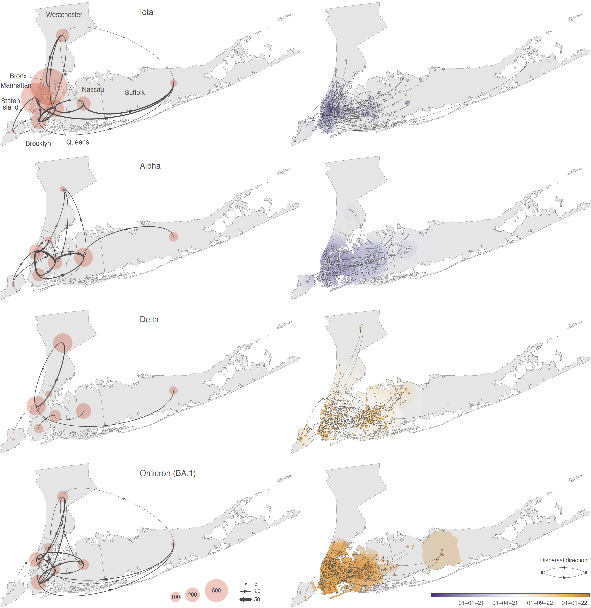
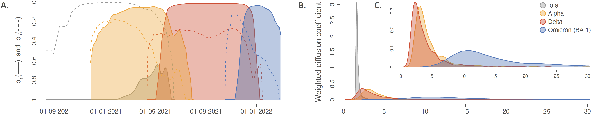

This repo gathers the input files and scripts related to our study entitled "**Variant-specific introduction and dispersal dynamics of SARS-CoV-2 in New York City — from Alpha to Omicron**" ([Dellicour *et al*. 2023](https://journals.plos.org/plospathogens/article?id=10.1371/journal.ppat.1011348), *PLoS Pathogens*). R scripts related to the analyses are all gathered within the file `Phylogenetic_analyses.r`.

Abstract: Since the latter part of 2020, SARS-CoV-2 evolution has been characterised by the emergence of viral variants associated with distinct biological characteristics. While the main research focus has centred on the ability of new variants to increase in frequency and impact the effective reproductive number of the virus, less attention has been placed on their relative ability to establish transmission chains and to spread through a geographic area. Here, we describe a phylogeographic approach to estimate and compare the introduction and dispersal dynamics of the main SARS-CoV-2 variants – Alpha, Iota, Delta, and Omicron – that circulated in the New York City area between 2020 and 2022. Notably, our results indicate that Delta had a lower ability to establish sustained transmission chains in the NYC area and that Omicron (BA.1) was the variant fastest to disseminate across the study area. The analytical approach presented here complements non-spatially-explicit analytical approaches that seek a better understanding of the epidemiological differences that exist among successive SARS-CoV-2 variants of concern.

**Figure 2: investigating the dispersal patterns of sampled SARS-CoV-2 lineages in the NYC area.** We here report both a discrete (left) and continuous (right) phylogeographic reconstruction of the dispersal history of viral lineages belonging to the Iota, Alpha, Delta, and Omicron (BA.1) variants. For the discrete reconstructions, we report the number of lineage dispersal events inferred between (arrows) and within (transparent red circles) boroughs/counties of the NYC area, both measures being averaged over 900 trees sampled from each posterior distribution. Specifically, we only report averaged numbers of lineage dispersal events between boroughs/counties associated with an adjusted Bayes factor support higher than 3, which corresponds to a ‘positive support’ [23]. For the continuous reconstructions, we map the maximum clade credibility (MCC) tree and overall 80% highest posterior density (HPD) regions reflecting the uncertainty related to the Bayesian phylogeographic inference. MCC trees and 80% HPD regions are based on 900 trees sampled from each posterior distribution. MCC tree nodes are coloured according to their time of occurrence, and 80% HPD regions were computed for successive time layers and then superimposed using the same colour scale reflecting time.

**Figure 3: comparing the introduction and dispersal dynamics of SARS-CoV-2 variants in the NYC area.** **A**: Evolution of (i) the probability p1 that two circulating lineages drawn at random belong to the same clade/cluster introduced into the study area (solid curves), and (ii) the proportion p2 computed as the ratio between the number of circulating clusters and the number of phylogenetic branches occurring at the same time across the study area (dashed curves). **B**: Posterior distributions of the weighted diffusion coefficient (km2/day) estimated for each variant. **C**: Posterior distributions of the weighted diffusion coefficient estimated for each variant except Iota, which allows a focus on the results obtained for the three other variants. All the results reported in Fig 3 are based on 900 trees sampled from each posterior distribution obtained by discrete (A) or continuous (B-C) phylogeographic inference.
